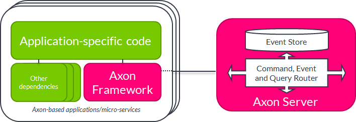

# Architecture overview

The Axon platform consists of two parts: Axon Framework and Axon Server. 

Axon Framework is a Java library. It gets included in your custom Java (Kotlin, Scala) application as a dependency, typically through Maven. As a library, it helps you write applications using CQRS, DDD and event sourcing principles. Axon Framework has a concept of location transparency: couplings are realized by exchange of command, event and query messages over bus interfaces.

Axon Server is a stand-alone server runtime that helps to run Axon applications at any scale. It can store many billions of events without running into the problems that relational databases have at that scale. And it will correctly route all types of messages between hundreds of application instances, without requiring any configuration: it will discover the correct routing automatically.   

The complete Axon platform is the easiest way to build a microservices system in Java, allowing developers to focus on the business functionality and let Axon take care of the rest.

Since Axon 4.0, Axon Framework by default assumes the presence of Axon Server. Nevertheless, it is still possible to run Axon Framework 4.0-based applications without Axon Server, just like it was the case in Axon Framework before 4.0. An RDBMS or Mongo can be used as an event store, and commands can be distributed using JGroups or Spring Cloud routing (or, you can build a traditional monolith and not use command and query distribution). In practice, these kinds of distributed configurations have shown to be difficult to set up correctly, which is why created Axon Server and default to using it in Axon 4.0.
