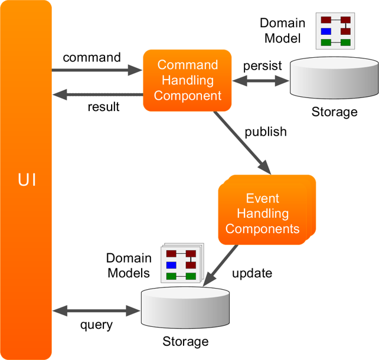
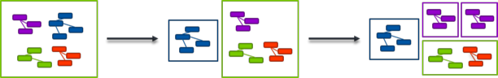

# Architecture Overview

Axon based applications follow an architectural pattern which is based on the principles of Domain-Driven Design \(DDD\), Command Query Responsibility Segregation \(CQRS\) and Event-Driven Architecture \(EDA\). The combination of these principles make Axon based applications more robust and adaptable to accommodate change required by the changes in our business domain.

Axon finds its use in both large monolithic applications, wherein the internal structure is essential to keep the monolith adaptable, as well as microservices, where the distributed nature of the system adds complexity.

The following sections describe how the different principles relate and how Axon uses these principles to help you build more maintainable, performant and reliable software.

## Dealing with complexity

Axon originated in an attempt to find a solution to the ever-increasing accidental complexity. Applying concepts from Domain-Driven Design will help to a very large degree, even the most well-designed model will not run by itself in production.

While Axon is opinionated on how the interaction with a domain model should take place, it tries to avoid any restrictions on the modelling freedom that one has. Even when your opinion differs from that of Axon, there are enough hooks, configuration options and triggers to change certain aspects of Axon's behavior. You will find those throughout the reference guide.

### DDD & CQRS

Domain-Driven Design \(DDD\) describes an approach to building software that puts a lot of emphasis on the design of a model, leveraging the use of ubiquitous language . The domain model is the heart of software, and should correctly capture and deal with the essential complexity of the domain.

Command Query Responsibility Segregation \(CQRS\) is an architectural pattern that describes the distinction between the parts of an application that deals with Commands \(requests to change an application's state\) and those that answer Queries \(requests for information about the application's state\).

When combining DDD and CQRS, one divides an application into components, where each component either provides information about the application's state, or that changes the application's state. Each of these components have a model that focuses on these responsibilities.

The image below shows a typical architecture of an Axon based application.

In such an architecture, a UI \(or API\) can send commands to request to change an application's state. These Commands are handled by a Command Handling component, which uses a model to validate the command and make decisions on which side-effects to trigger \(if any\).

The side-effects caused by Commands are published using Events. These Events are picked up by one or more Event Handling components that take the appropriate action. A typical action is updating the view models, which allow the UI to render the application's state. Other actions could be sending messages to external components, or even triggering other side-effects through new commands.

The separation of the Command Model and the Query Models \(also called View Models or Projections\) allows these models to only focus on that specific aspect of the application. This makes each individual model easier to comprehend, and therefore more maintainable in the long term.

### Separation of business logic and infrastructure

An increase in accidental complexity is often caused by leaky abstractions where infrastructure concerns are mixed with business logic. Axon makes it a top priority to keep the two strictly separated. Everywhere in Axon's design, it makes a clear distinction between _what_ you want to do \(e.g. publish an event\) and _how_ that is actually done \(e.g. event publication implementation\).

This makes Axon extremely configurable and adaptable to your specific situation. More importantly, it keeps accidental complexity to a minimum. For example, while Axon makes it easy to implement Event Sourced Aggregates, by no means does it enforce the aggregate to be Event Sourced. The Repository interface abstracts this decision entirely. Also, a component that decides to send a Command via a Command Bus, is in no way responsible for deciding how that message is transported to the handler.

Axon doesn't only make this separation by providing clear interfaces to components, it also combines the infrastructural choices in the Configuration API, there business logic components are configured separately from the infrastructural aspects of your application.

## Explicit Messaging

Axon strongly leverages the use of explicit message objects. This means that each Message in an Axon based application will generally be represented by a specific Java Class in that application. While this does create a little overhead in writing an Axon based application, it does come with a few advantages:

* The use of explicit messages makes it easier to transparently distribute them to remote components;
* The use of explicit messages puts an emphasis on message design, which has proven important in the long-term maintainability of an application;
* Explicit messages can be easily stored for later processing

While Messaging is a core concept in Axon, not all Messages are created equal. Different intents require different routing patterns. For example, for certain message, one would expect a result while others are inherently fire-and-forget.

Axon separates Messages in roughly three categories:

* **Commands**; express the intent to change the application's state. Commands are routed to a single destination and may provide a response.
* **Queries**; express the desire for information. Depending on the dispatch strategy, Queries may be routed to one or more destinations simultaneously.
* **Events**; represent a notification that something relevant has happened. Events are published to any component interested and do not provide any form of return value.

### Location transparency

The biggest benefit of using explicit Messages, is that components that interact with each other don't need to know the location of their counterpart. In fact, in most cases, the sending component isn't even interested in the actual destination of a message. We call this "Location Transparency".

Axon takes location transparency further than placing services behind a logical URL. In Axon, a component that sends a message does not need to specify a destination for that message. Messages are routed based on their stereotype \(Command, Query or Event\) and the type of payload that they carry. Axon uses an application's capabilities to find a suitable destination for a message automatically.

A system built up of Location Transparent components makes that system highly adaptable. For example, a monolithic system built out of well-separated components that communicate solely using Commands, Events and Queries, can be easily split into separately deployed units, without any impact on functionality.

This makes Axon highly suitable for Microservices environments. Logic can be easily moved from, to, and in-between deployed components without impact on the functional aspects of the system as a whole. The location of logic can then be primarily decided upon based on the non-functional requirements of each individual component of that system. Components that have clearly different performance characteristics, or components that require a different release cycle, could, for example, be split out of a monolithic application to reduce the impact of changes to this component.

### Event Sourcing

In many systems, events are given a lot of extra attention. While Axon clearly acknowledges that not every message is an Event \(there are also Commands and Queries\), there is something special about events.

Events retain value. Where the value of Commands and Queries reduce significantly when they have triggered their side-effects or provided their results, Events represent something that has happened, which may be useful to know for a long time after the occurrence of the event.

Events provide a very good level of granularity for an audit trail. However, for an audit trail to be 100% reliable it should not only be generated as a side-effect, one must also be able to ensure any decisions are correctly reflected by the audit trail.

Event Sourcing is the process where Events are not only generated as the side-effects of a Command, but also form the source of the state. While the current state of the application isn't explicitly stored in the database, it is implicitly stored as a series of events which can be used to derive the current state. On receipt of a Command the state of the application is dynamically derived from the events stored in the database and then decides which side-effects to apply.

Event Sourcing can be immensely complex to implement yourself. Axon provides the APIs necessary to make it very easy and even a more natural approach to building a command model. Axon's test fixtures help ensure that certain guidelines and requirements are properly followed.

Having a reliable audit trail has not only proven useful for auditability of a system, it also provides the information necessary to build new view models, do data analysis and provide a solid basis for machine learning algorithms.

