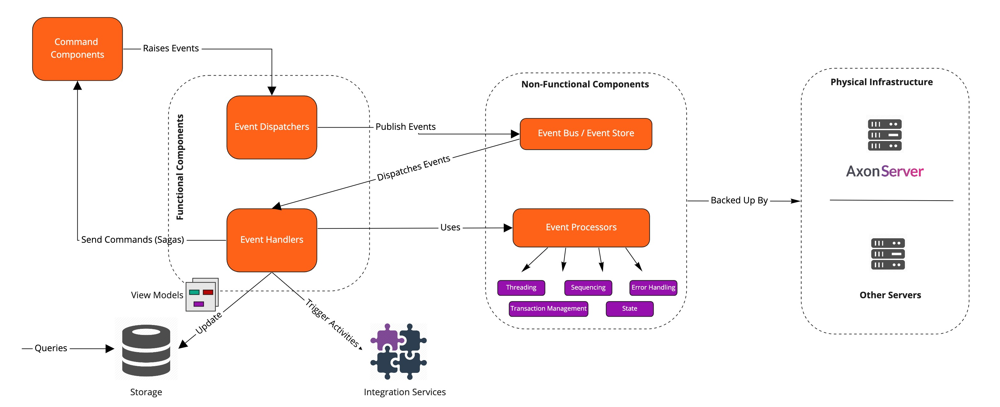

# Introduction

An Axon application raises events to notify that something relevant has happened within the system. The application needs to address the following concerns when it deals with  Event Messages.

* Raised Events need to be published _i.e. dispatched_  to interested subscribers.
* Published Events need to be acted upon i.e. _handled_  to execute certain actions.
* As the application evolves, it needs to cater to support different _versions_ of events.
* Events are stored in an Event Store they need a way to _serialize_ the event to prepare it for storage.
* Ability to _configure_ the various aspects related to dispatching/processing/handling and storage of Event Messages

This section of the reference guide is focused on detailing out the capabilities that the Axon Framework provides to help implement the concerns mentioned above.

To help implement the first two concerns i.e. Event Dispatching and Event Handling, the Axon Framework provides a set of _**Functional**_ and _**Non-Functional**_ components. 

### Functional Components

The Functional Components help address the _**business concerns**_ around Event Publishing and Event Handling i.e. the "_**When and What**_" \(e.g. When should Events be published ? What should the Event Message contain ? What should be the business logic that needs to be executed for an incoming Event Message?\).

The Axon Framework provides the following functional components

#### _Event Dispatchers_

Event Dispatcher Components are responsible for publishing Events that are raised within an Axon application e.g. a change as a result of a processed Command Message

The[ Event Dispatchers ](dispatching-events.md)section details the capabilities that the Axon Framework provides to help in the development of these Components.

#### _Event Handlers_

Event Handler Components are the components that act on published events i.e. they define the business logic to be performed when an Event is received

Usually, this involves,

* Updating View Models
* Trigger External Activities \(e.g. Third Party Integrations\) 
* Manage Complex Transactions \(Sagas\)

The [Event Handlers](handling-events.md) section details the capabilities that the Axon Framework provides to help in the development of these Components.

A summary of the representation of the functional components is depicted below.

### Non-Functional Components

The Non-Functional Components help address the _**technical concerns**_ around Event Publishing and Handling i.e. the "_**How**_" \(e.g. Which is the protocol we need to use to publish/deliver Event Messages ? How should errors be handled ? How do we implement the threading mode for processing Events ? How should we sequence the processing of Events?\) 

The Axon Framework provides the following  Non-Functional components.

#### _Event Bus / Event Store_

The Event Bus is the mechanism that is used to dispatch events to the subscribed Event Handlers. An Event Store offers the functionality of an Event Bus, with the addition that it persists published events.

The[ Event Bus/Event Store](event-bus-and-event-store.md) section details the capabilities that the Axon Framework provides to help in the development of these components.

_**Event Processors**_

As mentioned above, Event Handlers define the business logic to be performed when an Event is received. Event Processors are the components that take care of the technical aspects of that processing. This includes - Threading Modes, Sequencing Policies, Transaction Management and Error Handling. 

The [Event Processors](event-processors.md) section details the capabilities that the Axon Framework provides to help in the development and configuration of these components.

In both cases, these components are backed by an actual physical infrastructure \(e.g. [Axon Server ](../../axon-server.md)or Other Servers\)

A summary of the representation of the non-functional components is depicted below.

## Event Versioning

In the lifecycle of an Axon application, events _will_ typically change their format. As events are stored indefinitely the application should be able to cope with several versions of an event. The [Event Versioning ](versioning-events.md)section will discuss what to keep in mind when developing your events, for backwards \(and forward\) compatibility. It will deep-dive into the upcasting process provided by the Axon Framework to help achieve this concern

## Event Serialization

Events are stored in Event stores and there needs to be a way to serialize the event message to prepare it for storage. The [Event Serialization ](serializers.md)section will detail the various serialization capabilities that the Axon Framework provides to help address this concern.

