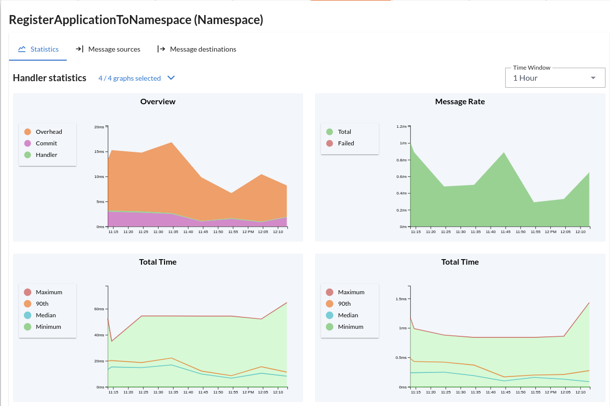

# Monitoring

The ability to monitor and measure what is going on is very important. 
This section contains all information regarding metrics, tracing and monitoring of your Axon Framework application.

> **Monitoring with AxonIQ Console**
> 
> We have built a platform that makes it very easy to monitor your Axon Framework applications.  It measures everything in your applications, aggregates, metrics and processors.
>
> 
>
> You can find more information on our [product page](https://www.axoniq.io/products/axoniq-console) or [log in directly](https://console.axoniq.io/).

A summary of the various subsections is given below.

| Subsection                              | Purpose                                                           |
|:----------------------------------------|:------------------------------------------------------------------|
| [Tracing](tracing.md)                   | Tracing support for Axon Framework                                |
| [Metrics](metrics.md)                   | How to configure and use metrics provided by Axon Framework       |
| [Health Indicators](health.md)          | Spring Boot actuator health indicators provided by Axon Framework |
| [Event Tracker Status](processors.md)   | Tracking the status of your event processors                      |
| [Message Tracking](message-tracking.md) | Tracking the origin of messages throughout your application       |
