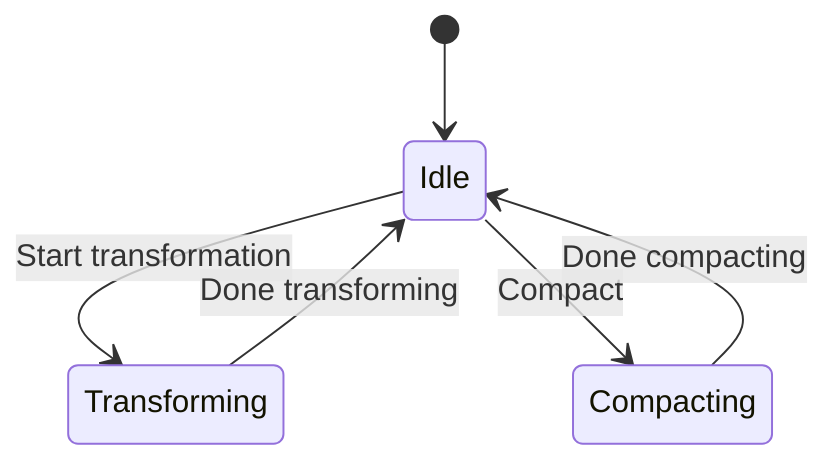
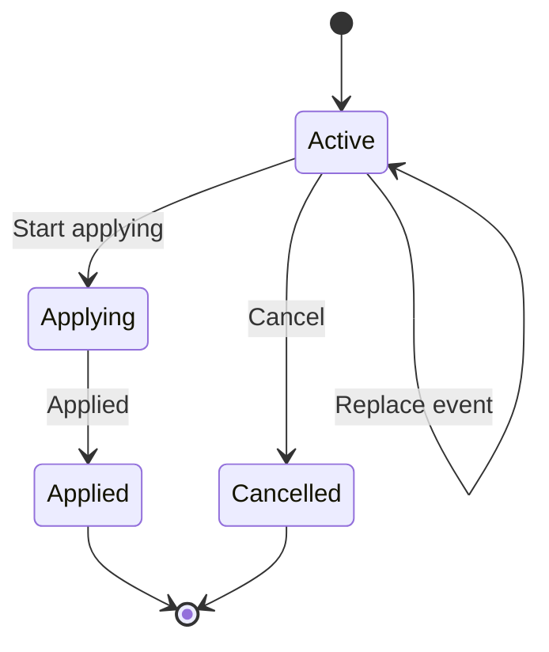

# Event transformation

The new Event Transformation feature allows users to perform specific event transformations like updates and deletes in the event store, utilizing the Event Transformation API.
This functional change is intended to facilitate more flexible event management in rare instances where modifications are unavoidable.

## Objective and Justification

Event transformation sounds like an oxymoron to you?

Don't worry, it is not our intention to change what is by its nature immutable: a fact happened in the past.
But there are situations when we believe it is not forbidden to manipulate the way the events are stored.

### What does it mean to transform events?

An event is immutable. An event lasts forever.
This is true, and we strongly believe in these rules.
But like any other rule, there are few exceptions that should not be underestimated.

Let's say that you start using your event store in production.
After some time you realize you have a security issue since you forgot to encrypt the sensitive data inside your
events. What should you do?

The only solution is to change the way events are stored in the event store.
This does not mean they change their semantic, but only their persisted representation.

Another typical use-case is when you want to forget some old data, because it is stale.
You just want to get rid of it, to free some space.

So, to sum it up: we transform events either by changing their format (not the semantic) or by deleting them.

#### When you could transform your events?

The event transformation feature fits well all situations where you need to manipulate the persisted representation
of the events, without touching their semantic.
It could be used, for example, in the following cases:

- to get rid of a large number of up-casters, which could affect your performance
- to encrypt sensitive data inside your events

#### When you should not transform your events?

The event transformation feature is not intended to manipulate events semantically.
It should not be used, for example, in the following cases:

- to fix a bug
- to change history

## What?

Whenever we need to change the representation of events in the Event Store, we desire this change to be as atomic
as possible. We are going to change events by introducing the concept of the Transformation. Transformation is
essentially a bucket of actions that are going to be performed against the Event Store. Currently, the supported actions
are the deletion of events and the replacement of events. Once we gather all actions that we want to use to transform
our Event Store, we are going to apply those actions to it.

Since the number of those actions we want to perform against the Event Store can be large, we must ensure that our Event
Store is not impacted by the Transformation itself. In other words, it must behave as the Transformation is not
happening at all.
Our little helper in this scenario is the fact that Event Store is immutable by its nature. We are going to create a new
version of our event segments by reading current events and transforming them according to the bucket of actions we have
collected for the specific Transformation. Axon Server will make sure to always read the latest version of event
segments. The transformation process will increase disk space usage, since it creates multiple versions of the same
events. For this reason, before you start transforming your events, make sure there is enough free disk space.
If you decide to change the entire Event Store in one Transformation, this would require free space larger than twice
the space occupied by the event store.

Once the transformation is complete, the disk space can be freed up again through the compaction procedure, a way to
clean older versions of event segments that should be invoked only when we are absolutely sure they are no longer needed.

To limit the possible misusing of the Event Store Transformation, we are going to make sure that there is only one
ACTIVE Transformation of the Event Store at the time. Having this in mind there are several states in which our Event
Store can end up in. Let's talk about them.

### The event store states

In order to prevent more than one transformation happening at the same time we are going to have our Event Store
transition between IDLE, TRANSFORMING, and COMPACTING states.

#### IDLE

IDLE state is the state representing a normal operation of the Event Store, meaning that there is no any Transformation
happening at the time. While being in this state, Event Store is open for starting a new Transformation. If choosing so,
we are going to end up in the following state called TRANSFORMING.

#### TRANSFORMING

Once our Event Store ends up in TRANSFORMING state, that means that no new Transformation can be accepted until we
either apply this Transformation or we cancel it. Do note, that even during TRANSFORMING state, Event Store can append
new events and can also read existing ones.

#### COMPACTING

By applying the Transformation to the Event Store, we are creating the new version of event segments. This can make a
significant impact on our disk space availability. To overcome that, Event Store introduces a compact option which will
get rid of all older versions of event segments. By compacting the Event Store we enter the COMPACTING state and once
compaction is done, we move back to IDLE.

#### State flow of the event store

Let's depict what we have talked about in previous chapter in a form of a state diagram.

### The transformation

As we already said, the Transformation is a bucket of actions. Those actions are event deletion and event replacement.
The Transformation itself is started by invoking the START TRANSFORMATION operation which moves the Event Store to
TRANSFORMING state and initializes the newly created Transformation in the ACTIVE state. After that, we are allowed to
send DELETE and REPLACE event actions to the Axon Server. Axon Server will store them durably. Up until this point, the
content of the Event Store remains unchanged. Once we are happy with the Transformation Actions, we can call the APPLY
operation to apply the Transformation; in other words, to effectively change the Event Store.

Depending on the number of actions, apply operation can take a while, but once it's completed, we can say that the
Transformation is APPLIED. After that, the Event Store moves to IDLE state.

Instead of applying the Transformation, we can also decide to CANCEL it; after the active Transformation has been
cancelled, the Event Store moves to IDLE state and this makes it available for accepting new Transformations.

#### APPLY considerations

As you might have concluded already, the apply process can take a while. This means that the caller cannot wait for this
process to complete. Hence, the caller is only going to START applying process, and it will be done in the background.
By monitoring the state of the Transformation you can understand when the apply process has been completed.

During the apply process, it might happen that while reading events you get a mixture of old and newly transformed
events. This is absolutely fine, and you must take this fact into the consideration when building your system that
invokes the Transformation.

#### State flow of the transformation

Let's depict what we have talked about in previous chapter in a form of a state diagram.

#### Cleaning Transformation Resources

Once we apply or cancel the Transformation, the actions we have collected and stored are useless. To mitigate this issue
there is a Cleaning Task that is going to from time to time check whether there are resources to be cleaned. Basically,
it'll check for all applied and cancelled transformations and clean their resources.

#### Cluster considerations

When a Transformation runs in a cluster environment, several aspects must be taken into consideration.

* The Transformation creation is replicated across the nodes in the same replication group.
* The Transformation Actions are replicated too. In other word, each node will persist all Transformation Actions.
* Apply and Cancel Operations are replicated.
* Each node does the applying of the Transformation at its own pace.
* Once all storage nodes in the replication group have applied the Transformation, the Transformation is considered
  APPLIED. The majority of nodes in not enough. The reason for this maybe strong requirement is to prevent possible mixed
  scenarios.

## How?

Axon Server will need to persist your Event Transformation Actions to a dedicated storage.
By default, the location where all transformation data is stored is the `transformation` folder.
You can customize this location using the following property:

`axoniq.axonserver.transformation.storage`

Please be aware that the transformation store could be huge, exactly like the event store.
Select a storage location with a suitable size.

### How to transform events

Anytime you want to change events already written in the event store, you need to create a new Transformation.
A newly created Transformation is in ACTIVE state. While being ACTIVE, the Transformation can accept all changes you
want to perform.
Once all changes have been registered, the Transformation can be APPLIED.
Only when the Transformation is applied the changes are effective inside your Event Store.

The simplest way to transform the events in your Java project, is to use the Axon Server Connector.
Axon Server Connector supports Event Transformation feature starting from version 2023.1.0.

#### Connecting to Axon Server

You can use `AxonServerConnectionFactory#forClient` static method to build your `AxonServerConnectionFactory` that could
be used to open a new `AxonServerConnection`. See the following example:

    AxonServerConnectionFactory.forClient("event-transformer")
                               .routingServers(new ServerAddress("localhost", 8124))
                               .build();

The `AxonServerConnectionFactory` can be used to establish a connection with a specific `context`, using the method
`AxonServerConnectionFactory#connect(context)`. This method establishes a long living connection to Axon Server for
the specified context. This connection remains open until the `AxonServerConnection#disconnect` method is invoked.
You can check whether your client is connected by invoking the `AxonServerConnection#isConnected` method.

Remember to always disconnect your client after you performed the desired operation.

#### Fluent API

The simplest way to transform your events is to implement your own `EventTransformer`.
The `EventTransformer` is simply a `BiConsumer<EventWithToken, Appender>`, where the first argument is the original
event, and the second argument is the `Appender` that can be used to append the desired transformation action for the
event. In other words, the `Appender` allows you to perform two different operations:
- delete event
- replace event

To better understand how to use the `EventTransformer`, we will analyze the following example:

`EventSources.range(() -> connection.eventChannel(), 0, 200)
.filter(eventWithToken -> isUnencrypted(eventWithToken.getEvent()))
.transform("Encryption of sensitive data",
(eventWithToken, appender) -> appender.replaceEvent(eventWithToken.getToken(),
encrypt(eventWithToken.getEvent())))
.execute(() -> connection.eventTransformationChannel())
.get();`

In order to access to the events currently stored in your Event Store, you can use the static methods offered by
`EventSources` interfaces. The `range(eventChannelProvider, fistToken, lastToken)` method, will allow you to access the
event stream starting from the specified firstToken, until the specified lastToken.

It is possible to filter the event stream, invoking the `filter(predicate)` method.
When the stream is properly filtered (if needed), it is possible to transform the events, by invoking the `transform`
method, with the description of the Transformation and the `EventTransformer` that implements the business logic of the
transformation itself. Since the `EventTransformer` is a functional interface, it can also be expressed as a lambda.

These APIs take a declarative approach, that means that nothing happens until the pipeline is not executed, invoking the
`execute(eventTranformationChannelSupplier)` method.

This method takes care of multiple operations:
- open a new transformation with the specified description
- run the event transformer
- request the transformation to be applied

The `execute` method returns a `CompletableFuture`: wait for the completion before checking the result.
The request to apply the transformation is executed by a scheduled task. That means that you could wait some time
before being able to see the events transformed in your Event Store.

If you don't need to read the events currently stored in your Event Store, you can transform your events by implementing
your own `Transformer`. The `Transformer#transform(appender)` provides you the `Appender` needed to append the required
transformation actions.

For example, you can delete the event with token 100 and replace event with token 562L with the following snippet:

        Transformer transformer = appender -> {
            appender.deleteEvent(100L);
            appender.replaceEvent(562L, replacement);
        };

You can run the Transformation by invoking the `EventTransformationChannel#transform` method.

        connection.eventTransformationChannel()
                  .transform("Transformation test", transformer);

As before, this method takes care of multiple operations:
- open a new transformation with the specified description
- run the transformer
- request the transformation to be applied

And don't forget that also the `transform` method returns a `CompletableFuture`.
As before, you must wait for its completion, and after that, you could wait some time before being able to see the
events transformed in your Event Store.

#### Step-by-step way to transform your events

If you want to have a full control of all the state changes of your transformation, you can use the `ActiveTransformation`.

In order to open a new transformation, use the `EventTransformationChannel#newTransformation(description)` method.

To transform your Event Store, you need to implement a `Transformer` (just like in the prev example).
The transformer will be executed by invoking the `ActiveTransformation#transform(transformer)` method.

An active transformation can be either applied or cancelled.
To apply the active transformation, you can use `ActiveTransformation#startApplying()` method.
To cancel the active transformation, you can use `ActiveTransformation#cancel()` method.

All methods in `ActiveTransformation` return `CompletableFuture`s. Remember to compose them when needed.

This is the snippet of code that opens a new Transformation with the specified description, runs the transformer and
finally requests the transformation to be applied.

        connection.eventTransformationChannel()
                  .newTransformation("My transformation description")
                  .thenCompose(activeTransformation -> activeTransformation.transform(transformer))
                  .thenCompose(ActiveTransformation::startApplying);

#### Access control

When engaging in event transformation, certain roles are necessary to ensure secured process. Here's a detailed explanation of each role:

 **TRANSFORM**  

Users granted the TRANSFORM role can prepare a transformation and get information about transformations.
However, they are not able to apply transformations.

**TRANSFORM_ADMIN** 

To apply a transformation you need the transform_admin role.

To create and apply transformations **users will need both roles**.

#### How to check the transformations for a context

In order to read all transformations that have been created for a context, you can use the `EventTransformationChannel`
provided by your `AxonServerConnection`.

The method `EventTransformationChannel#transformations` will provide a `CompletableFuture` of all the transformations
created for a context and their current state. Remember, you can have one and only one ACTIVE transformation for each
context.

### How to compact the event store

Whenever a transformation is applied, the events in the Event Store are changed.
Axon Server, to perform the changes, does not delete the previous form of the events, it just creates a new version
of the events saving them into a new segment version.

This choice was made for security reasons, because we don't want the Axon Server to delete anything unless explicitly
requested. However, this choice has a negative impact on disk space. In fact, every time I create a new segment version,
I'm doubling the space needed to save those events.

For this reason, Axon Server provides a feature that allows you to compact the event store, deleting the previous
versions once they are no longer needed.

You can request the compaction by invoking the `EventTransformationChannel#startCompacting` method.
Be carefull, this will permanently delete the previous versions of your events.

### Troubleshooting

#### "There is already ongoing transformation"

Remember, you can have one and only one ACTIVE transformation for each context. If you try to create a new
transformation when there is another one in ACTIVE state, you will receive this error.

To solve the problem, you can either
- cancel the already existing ACTIVE transformation
- apply the already existing ACTIVE transformation
- continue working on already existing ACTIVE transformation starting from where it stopped

In the last case, you can retrieve the `ActiveTransformation` that is already created with the method
`EventTransformationChannel#activeTransformation`.

### How to use the GRPC API directly

If you are not using Java, or if you are just curious to try, you can try to use the GRPC/HTTP operations directly.

For HTTP endpoints, please refer to the Swagger UI for the documentation.

### How to deactivate the transformation feature in Axon Server

The Event Transformation functionality is enabled by default, starting from AxonServer 2023.1.0.
In order to deactivate the feature, it is sufficient to add the following property in Axon Server property file:

`axoniq.axonserver.event-transformation.enabled=false`

