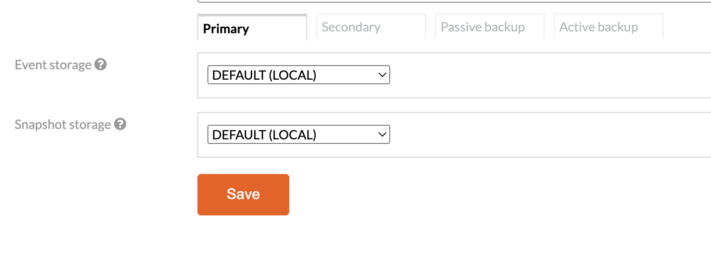

# Multi-Tier Storage

Multi-tier storage is a useful feature that allows you to store data across different levels of storage media based on access speed and cost. This helps optimize performance and reduce overall storage costs by placing frequently accessed data on faster storage media, such as SSDs, and less frequently accessed data on slower but more cost-effective storage media, such as HDDs.

In a multi-tier storage system, data is usually classified according to its importance or frequency of use, and then automatically migrated between storage tiers based on these criteria. This approach helps users to optimize their storage resources, reduce costs, and improve performance by ensuring that data is stored on the most appropriate type of storage media.

# Axon Server Tiered Storage

In Axon Server, there are two types of Multi-Tiered Storage - Local Multi-Tier Storage and Secondary Nodes - that work differently but can complement each other.

Let's first explain these two different options and compare them to each other. 

## Multi-Tiered Storage (local)


_Tier configuration is shared with all nodes. Each node maintains tiered storage independently storing on its own unique storage locations._

Multi-Tiered Storage is a feature that enables each node to maintain a local representation of its own tiered storage over its event store replica. This feature allows you to configure multi-tier storage for different node role types, including primary, secondary, and backup nodes. Nodes of the same role share a multi-tier configuration execute segment-moving operations locally, and independently. For this reason, it is possible for segments to not be transferred at the same time on all nodes due to timing differences, but this is not a problem, and over time, the tiers will become synchronized.

With Multi-Tiered Storage, you can configure as many tiers as you need, and you can set retention intervals for each tier to determine after which interval the data should be moved from one tier to another. There are several supported tier types available, including the default, custom storage, and black hole.



_Multi-tier configuration within Context page - Axon Server Enterprise Edition_

### Default

The Default tier is a convenient option that allows you to quickly set up your event store without having to specify a custom location on disk. If you do not have any specific requirements for the physical storage location of your event data or you are migrating from an older version of Axon Server where the event store location was set via environment variables, then using the Default tier is a suitable initial tier to use.

### Custom storage

The Custom storage tier enables you to set a custom location for a specific tier in Axon Server. You can choose storage via a dropdown menu. To add storage locations to the dropdown menu, you need to configure Axon Server with additional properties. This can be done either through a property file or environment variables, using the following syntax:

```
axoniq.axonserver.event.storages.{storage name}={path to storage}
axoniq.axonserver.snapshot.storages.{storage name}={path to storage}
```

For example, to set the `slow_disk` storage location to `/hhd2/eventstore`, you can add the following line to your configuration:

```
axoniq.axonserver.event.storages.slow_disk=/hhd2/eventstore
axoniq.axonserver.snapshot.storages.slow_disk=/hhd2/eventstore
```


You can add as many storage locations as needed, such as different hard drives or even mounted network drives, but it is important to configure the given storage on all nodes in the Axon Server cluster.

Configuration is shared for all nodes of the same role. That's why all nodes should provide paths where they want to store data for certain named locations (storages). After configuration is set, it's replicated to all nodes, after that nodes maintain and run segment-moving operations on their own, independently.

Storage locations are referenced by name (e.g., slow_disk), and the provided path is resolved at runtime on each node. It's important that path on each node points to a **unique physical location**!


### Black Hole Tier

The Black Hole tier is tier type in Axon Server that consumes your events, and you will never see them again.

Using the Black Hole tier will mark your context as **ephemeral**, which means that data is permanently removed after a specified retention interval. **Once the data is removed, it cannot be recovered**, so it's essential to use this feature with caution and only if you're certain that you no longer need the data.


_Context using a black hole tier will be marked as ephemeral and the flow of data will be visualized (only for primary nodes)_

#### Use cases for ephemeral context
Ephemeral context is particularly useful in scenarios such as event streaming or integration contexts, where events are published to multiple observers in real-time, and after some time, the events are no longer of interest. Another use case is for contexts that produce many events, like notifications, which are no longer useful for the business after a certain period.

**However:**
The Black Hole tier should not be used if you have event-sourced aggregates.
Ephemeral context is not suitable for fine-grain event removal as it removes segments per whole, that contain many different events of different types of aggregates, making it difficult to remove specific events.
For such a scenario use the **Event Transformation tool.**

#### Conditional Removal
In the case you need to use event-sourced aggregates and want to delete events after a period of time and ensure that you always have a valid state, Axon Server provides an experimental feature called conditional removal, which allows you to remove segments conditionally.
To use this feature, you first need to enable snapshots for your aggregates.
Setting the conditional property (available by editing context properties in the UI) 

```experimental.black-hole.conditional-remove = 1```  

instructs the black hole tier to remove an event segment only if each event in the segment was previously included in a snapshot. It also removes a snapshot segment only if there is a newer snapshot for each snapshot in the segment.
However, note that this feature is experimental, and it comes with some caveats. For example, there are many events of different aggregates in one segment. If only one aggregate from this segment does not have a snapshot, it may prevent the segment from being deleted indefinitely.  This feature is best used if you have a small number of aggregate instances, ideally one aggregate, which is a common case for integration purposes contexts.

Another safer usage of condition removal and black hole tier, is to enable it only for snapshot storage. With that after some time older non-used snapshots will be removed, but latest snapshot will be always available for each aggregate.


_Configuring conditional remove in context properties_

### Retention Intervals
Axon Server supports both time-based and size-based retention intervals for multi-tiered storage.


_Retention interval options for tiered storage_

#### Time-Based Retention
Time-based retention specifies how long a segment should be in one tier before being moved to another tier. After the segment is closed for writing and the retention time is due, the segment becomes eligible to move to the next tier.

#### Size-Based Retention
Size-based retention monitors the size of the whole tier. After the size threshold is breached, the oldest segments in the tier that are outside of the size boundary are moved to the next tier, maintaining the specified size of the tier.
_Specified size is calculated only using event segment file sizes and does not include index file sizes. So, make sure to leave enough space on the disk for indexes and for the currently open segment._
Size-based retention is useful when you want to keep the newest events on fast storage limited by size, while moving everything else to a slower disk.


## Controlling the flow of data
Axon Server allows you to control the flow of data between tiers. You can limit the rate of segment moves to prevent large IO spikes. You can also pause the segment moving operation to prevent data from being moved between tiers.

### Setting IO Rate Limits

You can limit the max number of segments that can be moved per minute by setting the following properties:

`event.segment-move-rate=5`

By default, the max number of segments that can be moved per minute is set to 5. This setting can be changed within the context properties in Axon Server UI.


_Limiting IO rate in context properties for a given context_

#### Pausing moving operation


In some cases, you may want to pause the multi-tier segment moving operation. This can be useful in emergency situations or during maintenance/backup operations.

To pause the segment moving operation, set the segment move rate to zero: `event.segment-move-rate=0`

To resume the segment moving operation, simply set the segment move rate to a non-zero value.


### Metrics

To track the flow of data from one tier to another, we provide a few useful metrics:

```
file_segment_moved_initiated_total{axonserver="axonserver-enterprise-1",context="mycontext",fromTierLevel="0",type="EVENT",} 11.0
file_segment_moved_completed_total{axonserver="axonserver-enterprise-1",context="mycontext",fromTierLevel="0",type="EVENT",}10.0
file_segment_moved_duration_seconds_sum{axonserver="axonserver-enterprise-1",context="mycontext",fromTierLevel="1",type="SNAPSHOT",} 0.53
```

_Example of metrics for tracking the flow of data in tiered storage_


`file_segment_moved_initiated` - counts how many segments, per context, per tier level, were initiated to be moved to next tier

`file_segment_moved_completed` - counts how many segments, per context, per tier level, was successfully moved to next tier

`file_segment_moved_duration` - measures how long did it take to move segments to next tier

`file.segment.per.tier` - current number of segments per each tier


> **Limitations to changing and adding to tier configuration**
>
> While it is possible to change the conditions for moving data from one tier to the next, it is not possible to change the order of tiers. Currently, new tiers can only be added at the end and removal of existing tiers is not possible.
> In the future, it is expected that it will be possible to alter the configuration completely.
>

## Secondary Nodes

Secondary Nodes are a feature in Axon Server that allows you to reduce the number of copies of data that is stored, by keeping only the most recent event store on your primary nodes and keeping the full event store on the secondary nodes.

The primary nodes can have faster (more expensive) disks, while the secondary nodes can have slower but more cost-effective disks. This can help reduce storage costs without significantly impacting performance.

When Axon Server processes a transaction to append events, the leader replicates this transaction to all of the nodes in the cluster. This includes the primary nodes, as well as the secondary and backup nodes. While the leader will be satisfied when the majority of the primary nodes have acknowledged the receipt of the transaction, it will also keep track of the progress of the other nodes.
Each node holds an exact copy of the data initially. So with a cluster of three nodes, each element of data (typically events) will be stored a total of three times. The main reason for this is to ensure that the failure of a single node will not result in the data becoming unavailable or lost. This is particularly relevant for recent information, which is accessed frequently by various event processors, and when using event sourcing.

However, the added value of these extra copies degrades over time, as these entries are accessed less frequently.
Secondary nodes contain a full copy of all the data that the primary nodes also process. While replicating that data, they inform the primary nodes of their progress. Once the data has aged to the configured retention time, it becomes eligible for _removal from the last tier in primary nodes_, but only if all available secondary nodes have a safe copy of that data.

When primary nodes need to access old data, they will retrieve it from the secondary nodes.
By using secondary nodes, you can leverage concurrent access performance of faster disks while minimizing cost by moving events to slower disks once access requirements are reduced. Additionally, a secondary node could be used to keep access for incidental operational use of older events. This secondary node could use several storage tiers to be able to cope with the large amount of data to store. If needed, after a certain retention period, data can be removed altogether.

### Tiered storage vs Secondary Nodes
#### How are Secondary Nodes Different?

The main difference between Secondary Nodes and Tiered Storage is the cardinality of data.

Secondary Nodes allow for a reduction in the number of copies of each data element that is stored; whereas in Tiered Storage, the number of copies always equals to the number of nodes in the cluster.
Another significant difference is that Secondary Nodes copy all the data, including the most recent events, even though they still exist on the primary node. Once the data has aged to the configured retention time, it becomes eligible for removal from the primary nodes, but only if all available secondary nodes have a safe copy of that data. In contrast, Tiered Storage involves an actual data copy operation at the moment data transitions from one tier to the next.

#### How Can They Complement Each Other?
The differences between Secondary Nodes and Tiered Storage allow for interesting data management techniques. High-performance systems require the ability to concurrently ingest data and read events for event sourcing. Additionally, events that are "cooling down" may still occasionally be needed for operational purposes, making the availability of this data essential.
In such scenarios, one could use SSD and HDD on the primary nodes to leverage the concurrent access performance of SSD and minimize costs by moving events to a local HDD once access requirements are reduced. Additionally, a Secondary node could be used to keep access for incidental operational use of older events. This Secondary node could use several storage tiers to cope with large amounts of data to store.
By combining Secondary Nodes and Tiered Storage, users can effectively manage their data and strike a balance between performance and cost.


_Example of a tiered setup that keeps most up-to-date events in primary nodes. After a given period of time data is removed from primary nodes and reduced to one replica in one secondary node which deletes data after a long period of time._

### Configuring and Using Secondary Nodes
To use the multi-tier storage feature with secondary nodes, the replication group for the context must have nodes with `SECONDARY` role. You may consider to have at least two nodes with `SECONDARY` role to prevent a single point of failure.
To configure a secondary node, you need to add it to the Axon Server cluster as a new node with the `SECONDARY` role. You can do this by installing Axon Server on a new machine, configuring it to use the same Axon Server instance as the primary node, and starting it up with the `SECONDARY` role.
Once the secondary node is up and running, it will automatically start replicating data from the primary node. By default, the secondary node will store a full copy of all data that the primary nodes also process. While replicating that data, the secondary node informs the primary nodes of its progress.
To control the retention time of events on the primary nodes, you can set the retention time properties in the context properties.

```
event.retention-time=10d
snapshot.retention-time=10d
```

_Entering number without unit defaults to milliseconds, but you can specify a value with a unit, for instance 1d or 5h._

This allows you to specify how long events will be kept on the primary nodes before they are eligible for removal. If you have primary nodes with multiple tiers, data will be removed only from last tier.

Once events are removed from the primary nodes, they will still be available on the secondary nodes.
To access old data on the primary nodes, you can retrieve it from the secondary nodes. This ensures that your data remains available even after it has been removed from the primary nodes, as long as it is still available on the secondary nodes.
Overall, secondary nodes provide a way to reduce the number of copies of each data element that is stored, while still maintaining the availability of that data.
