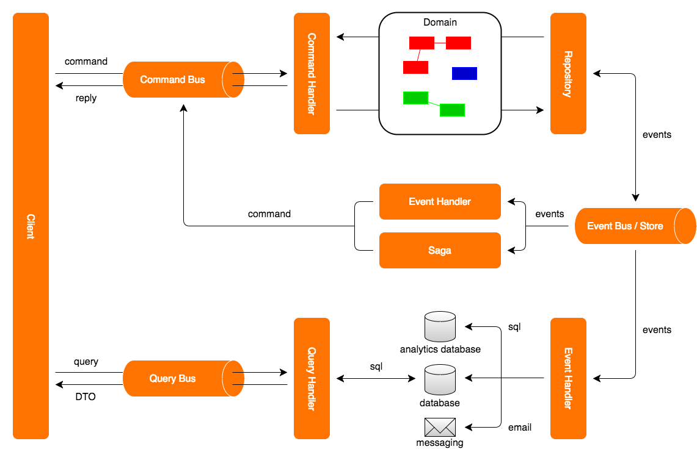

Architectural Overview
======================

CQRS on itself is a very simple pattern. It only prescribes that the component of an application that processes commands should be separated from the component that processes queries. Although this separation is very simple on itself, it provides a number of very powerful features when combined with other patterns. Axon provides the building blocks that make it easier to implement the different patterns that can be used in combination with CQRS.

The diagram below shows an example of an extended layout of a CQRS-based event driven architecture. The UI component, displayed on the left, interacts with the rest of the application in two ways: it sends commands to the application (shown in the top section), and it queries the application for information (shown in the bottom section).

Commands are typically represented by simple and straightforward objects that contain all data necessary for a command handler to execute it. A command expresses its intent by its name. In Java terms, that means the class name is used to figure out what needs to be done, and the fields of the command provide the information required to do it.

The Command Bus receives commands and routes them to the Command Handlers. Each command handler responds to a specific type of command and executes logic based on the contents of the command. In some cases, however, you would also want to execute logic regardless of the actual type of command, such as validation, logging or authorization.

The command handler retrieves domain objects (Aggregates) from a repository and executes methods on them to change their state. These aggregates typically contain the actual business logic and are therefore responsible for guarding their own invariants. The state changes of aggregates result in the generation of Domain Events. Both the Domain Events and the Aggregates form the domain model.

Repositories are responsible for providing access to aggregates. Typically, these repositories are optimized for lookup of an aggregate by its unique identifier only. Some repositories will store the state of the aggregate itself (using Object Relational Mapping, for example), while others store the state changes that the aggregate has gone through in an Event Store. The repository is also responsible for persisting the changes made to aggregates in its backing storage.

Axon provides support for both the direct way of persisting aggregates (using object-relational-mapping, for example) and for event sourcing.

The event bus dispatches events to all interested event listeners. This can either be done synchronously or asynchronously. Asynchronous event dispatching allows the command execution to return and hand over control to the user, while the events are being dispatched and processed in the background. Not having to wait for event processing to complete makes an application more responsive. Synchronous event processing, on the other hand, is simpler and is a sensible default. By default, synchronous processing will process event listeners in the same transaction that also processed the command.

Event listeners receive events and handle them. Some handlers will update data sources used for querying while others send messages to external systems. As you might notice, the command handlers are completely unaware of the components that are interested in the changes they make. This means that it is very non-intrusive to extend the application with new functionality. All you need to do is add another event listener. The events loosely couple all components in your application together.

In some cases, event processing requires new commands to be sent to the application. An example of this is when an order is received. This could mean the customer's account should be debited with the amount of the purchase, and shipping must be told to prepare a shipment of the purchased goods. In many applications, logic will become more complicated than this: what if the customer didn't pay in time? Will you send the shipment right away, or await payment first? The saga is the CQRS concept responsible for managing these complex business transactions.

Since Axon 3.1 the framework provides components to handle queries. The Query Bus receives queries and routes them to the Query Handlers. A query handler is registered at the query bus with both the type of query it handles as well as the type of response it providers. Both the query and the result type are typically simple, read-only DTO objects. The contents of these DTOs are typically driven by the needs of the User Interface. In most cases, they map directly to a specific view in the UI (also referred to as table-per-view).

It is possible to register multiple query handlers for the same type of query and type of response. When dispatching queries, the client can indicate whether he wants a result from one or from all available query handlers.

Axon Module Structure
=====================

Axon Framework consists of a number of modules that target specific problem areas of CQRS. Depending on the exact needs of your project, you will need to include one or more of these modules.

As of Axon 2.1, all modules are OSGi compatible bundles. This means they contain the required headers in the manifest file and declare the packages they import and export. At the moment, only the Slf4J bundle (1.7.0 &lt;= version &lt; 2.0.0) is required. All other imports are marked as optional, although you're very likely to need others.

Main modules
------------

Axon's main modules are the modules that have been thoroughly tested and are robust enough to use in demanding production environments. The maven groupId of all these modules is `org.axonframework`.

The Core module contains, as the name suggests, the Core components of Axon. If you use a single-node setup, this module is likely to provide all the components you need. All other Axon modules depend on this module, so it must always be available on the classpath.

The Test module contains test fixtures that you can use to test Axon based components, such as your Command Handlers, Aggregates and Sagas. You typically do not need this module at runtime and will only need to be added to the classpath during tests.

The Distributed CommandBus modules contain implementations that can be used to distribute commands over multiple nodes. It comes with JGroups and Spring Cloud Connectors that are used to connect these nodes.

The AMQP module provides components that allow you to build up an EventBus using an AMQP-based message broker as distribution mechanism. This allows for guaranteed-delivery, even when the Event Handler node is temporarily unavailable.

The Spring module allows Axon components to be configured in the Spring Application context. It also provides a number of building block implementations specific to Spring Framework, such as an adapter for publishing and retrieving Axon Events on a Spring Messaging Channel.

MongoDB is a document based NoSQL database. The Mongo module provides Event and Saga Store implementations that store event streams and sagas in a MongoDB database.

Several AxonFramework components provide monitoring information. The Metrics module provides basic implementations based on Codehale to collect the monitoring information. 

Working with Axon APIs
======================

CQRS is an architectural pattern, making it impossible to provide a single solution that fits all projects. Axon Framework does not try to provide that one solution, obviously. Instead, Axon provides implementations that follow best practices and the means to tweak each of those implementations to your specific requirements.

Almost all infrastructure building blocks will provide hook points (such as Interceptors, Resolvers, etc.) that allow you to add application-specific behavior to those building blocks. In many cases, Axon will provide implementations for those hook points that fit most use cases. If required, you can simply implement your own.

Non-infrastructural objects, such as Messages, are generally immutable. This ensures that these objects are safe to use in a multi-threaded environment, without side-effects.

To ensure maximum customization, all Axon components are defined using interfaces. Abstract and concrete implementations are provided to help you on your way, but will nowhere be required by the framework. It is always possible to build a completely custom implementation of any building block using that interface.

Spring Support
==============

Axon Framework provides extensive support for Spring, but does not require you to use Spring in order to use Axon. All components can be configured programmatically and do not require Spring on the classpath. However, if you do use Spring, much of the configuration is made easier with the use of Spring's annotation support.
